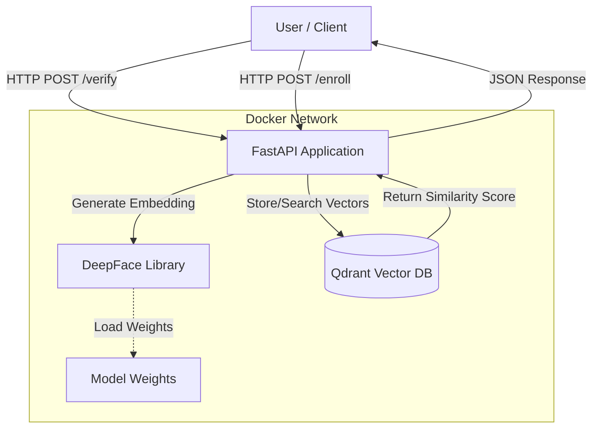

# System Architecture

## 1. High-Level Design
The system follows a **Microservices Architecture**, containerized using Docker. It consists of two main services:

1.  **API Service (FastAPI)**: The brain of the application. It handles HTTP requests, processes images, and runs the facial recognition logic.
2.  **Vector Database (Qdrant)**: The memory of the application. It stores "embeddings" (mathematical representations of faces) for fast retrieval and matching.

## 2. Component Diagram

## 3. Technology Stack

| Component | Technology | Purpose |
| :--- | :--- | :--- |
| **Backend Framework** | **FastAPI** | High-performance, async Python web framework. |
| **ML Library** | **DeepFace** | Wrapper for state-of-the-art face recognition models (ArcFace, VGG-Face). |
| **Vector Database** | **Qdrant** | Optimized engine for storing and searching high-dimensional vectors. |
| **Containerization** | **Docker** | Ensures consistent environment and easy deployment. |
| **Language** | **Python 3.10** | The standard language for AI/ML development. |

## 4. Data Flow (Verification)
1.  **Receive Request**: API receives ID card image and Selfie.
2.  **Preprocessing**: Images are converted to arrays; faces are detected and aligned.
3.  **Embedding Generation**: The ML model converts the face into a 512-dimensional vector.
4.  **Comparison**: The two vectors (ID vs Selfie) are compared using **Cosine Similarity**.
5.  **Decision**: If the similarity score is above a threshold (e.g., 0.5), it's a match.
